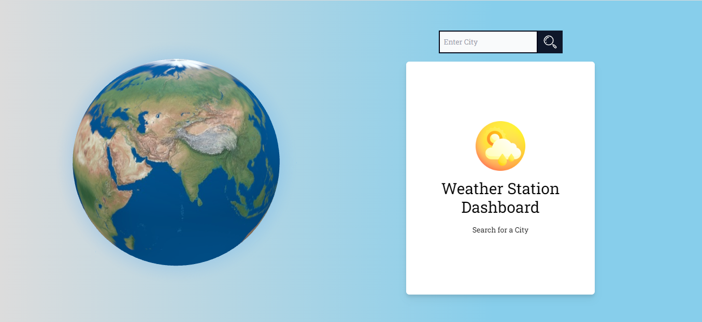

# React Weather App - With A 3D Globe

### APIs Used

[Open Weather APIs](https://openweathermap.org/)

https://openweathermap.org/current

### API Info

- Method: `GET`
- URL: `https://api.openweathermap.org/data/2.5/weather?q={CITY_NAME}&appid={API_KEY}`

### Libraries used

- `three`
- `react-globe.gl`
- `react-toastify`
- `styled-components`
- `tailwind css`

### How can I appreciate this repo?

- By giving this repo a 🌟
